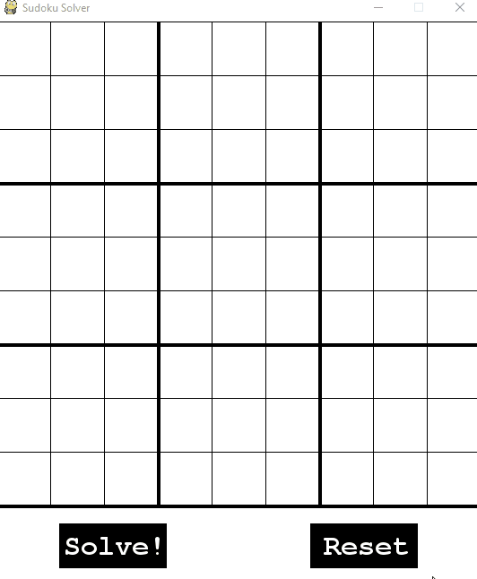

# SudokuSolver
A program to solve a given Sudoku puzzle

## How to run
First, download the code.  
Then download python from [here](https://www.python.org/downloads/) and install it.  
The GUI is written in [pygame](https://www.pygame.org/news) so that will need to be installed ([guide here](https://www.pygame.org/wiki/GettingStarted)). &nbsp;&nbsp;&nbsp;&nbsp;  
To begin the application, run the UserInterface.py script.

## How to use
### Populating the grid
&nbsp;&nbsp;&nbsp;&nbsp;To add a number to a cell click on it then type the number. The application will not allow you to enter a number if it is invalid (i.e. if you try to enter two of the same number in the same row/column/square). Alternatively, use the arrow keys to navigate to the desired cell then type in the number. To delete a number, press the delete key while the cell is selected. To clear every cell in the grid, click the "Reset" button.

### Solving the sudoku
&nbsp;&nbsp;&nbsp;&nbsp;To solve the sudoku, click the "Solve!" button. The black numbers are the numbers you have entered and the blue numbers are the numbers filled in by the solver.

